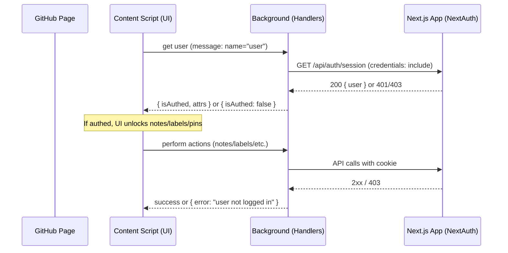

# dossi Extension Auth Guide (Next.js + NextAuth)

This document explains how authentication works for this Plasmo-based browser extension when paired with a Next.js app using NextAuth. It’s written for engineers and AI agents working on this repo.

## TL;DR

- The extension does NOT store access tokens. It relies on your NextAuth HTTP-only session cookie on your app’s origin.
- The background pages make all API calls with `credentials: "include"`, letting the browser attach the session cookie automatically.
- The extension checks if the cookie exists, then calls your session endpoint to cache the user. UI is gated on `user.isAuthed`.
- Use `SameSite=None; Secure; HttpOnly` cookies and keep API + web app on the same origin for the simplest, reliable setup.

---

## Architecture overview

- Content and popup UIs only talk to the background via `@plasmohq/messaging`.
- Background message handlers call your Next.js API with `credentials: "include"` so the session cookie is sent.
- A user check runs on demand and on page visibility changes to stay in sync with the website login state.



---

## Key files in this repo

- `background/messages/user.ts` — Cookie presence check and session fetch; caches `{ isAuthed, attrs }`.
- `background/messages/*.ts` — Entities, notes, labels, pins, activity, plan; all requests include credentials and map 403s to a clear error.
- `lib/background.ts` — Fetch helpers (`fetchWithCredentials`, `handleResponse`).
- `lib/constants.ts` — Builds `baseUrl` and `baseApiUrl` from environment variables.
- `contexts/user.tsx` — `AuthProvider` calls background to hydrate auth state and exposes `{ isAuthed, status, attrs }`.
- `contents/connct-sidebar.tsx` and `popup.tsx` — UI renders authed vs unauth states and routes sign-in to your app.

---

## Environment variables (extension)

Create a `.env` at repo root. Values below show typical dev settings.

```ini
# Host where your Next.js app runs
PLASMO_PUBLIC_HOST="https://localhost:3000"

# API base from the same host
PLASMO_PUBLIC_HOST_API="https://localhost:3000/api"

# The NextAuth session cookie name (match your NextAuth config)
PLASMO_PUBLIC_HOST_COOKIE="next-auth.session-token"

# Where to inject the content script (GitHub)
PLASMO_PUBLIC_MATCHES="https://github.com/*"

# Host permissions so the extension can access cookies/fetch on your app
PLASMO_PUBLIC_MANIFEST_HOST_PERMISSIONS="https://localhost:3000/*"
```

Notes:
- These envs are referenced in `package.json` manifest and by background handlers at runtime (via Plasmo bundling).
- Use your production domain values for a production build.

---

## NextAuth cookie configuration

To ensure the extension can include your session cookie from a different scheme (chrome-extension://), configure your NextAuth session cookie with:

- `SameSite=None`
- `Secure`
- `HttpOnly`
- Domain set to your app domain (apex if using subdomains)

Example (illustrative, adapt to your NextAuth version):

```ts
// next-auth.config.ts (example)
import NextAuth from "next-auth"
import type { NextAuthOptions } from "next-auth"

export const authOptions: NextAuthOptions = {
  // ...providers, callbacks, etc.
  cookies: {
    sessionToken: {
      name: process.env.NEXTAUTH_SESSION_TOKEN_NAME ?? "next-auth.session-token",
      options: {
        httpOnly: true,
        sameSite: "none",
        secure: true,
        path: "/",
        // domain: ".yourdomain.com" // if using subdomains
      }
    }
  }
}

export default NextAuth(authOptions)
```

Tips:
- Keep your web app UI and API on the same origin (e.g., `https://app.example.com` with API under `/api`).
- Use HTTPS in dev (mkcert or similar) so you can set `Secure` and `SameSite=None` reliably.

---

## Extension manifest permissions

The generated manifest (via Plasmo) should include at least:

- `permissions`: `["storage", "tabs", "cookies", "webNavigation"]`
- `host_permissions`: must include your app host(s) (dev and prod) so background can read cookies and make credentialed requests.

These are configured through `package.json` `manifest` plus envs (see `PLASMO_PUBLIC_MANIFEST_HOST_PERMISSIONS`).

---

## Runtime flows

### Sign-in
- User clicks Sign In in sidebar or popup (`/auth/signin` on your app).
- After successful auth, the NextAuth session cookie is set on your domain.
- When the GitHub page regains focus, `contexts/user.tsx` re-checks; background sees the cookie, fetches `/api/auth/session`, caches the user, and UI switches to authed.

### Sign-out
- User logs out on your site, cookie is removed/invalidated.
- Next check returns not-authed; background clears cached `user` and `labels`; UI renders signed-out state.

---

## Local development setup

1) Prepare your Next.js app
- Run it on HTTPS (recommended): `https://localhost:3000`.
- Ensure NextAuth session cookie is `SameSite=None; Secure; HttpOnly`.
- Confirm `GET /api/auth/session` returns `{ user: { id, name, email, image } }` when logged in.

2) Configure the extension
- Create `.env` as shown above for dev (localhost HTTPS).
- Install deps and start dev build:

```bash
pnpm install
pnpm dev
```

- Load the unpacked extension from the printed dev build path (e.g., `build/chrome-mv3-dev`).

3) Verify
- Open GitHub, click the dossi button in the injected UI.
- If not authed, click Sign In: completes on your Next.js app.
- Return to GitHub tab; the UI should now show authed features.

---

## Production deployment

- Use your production domain for all host envs:
  - `PLASMO_PUBLIC_HOST` = `https://app.example.com`
  - `PLASMO_PUBLIC_HOST_API` = `https://app.example.com/api`
  - `PLASMO_PUBLIC_MANIFEST_HOST_PERMISSIONS` = `https://app.example.com/*`
- Keep NextAuth cookie settings identical (`SameSite=None; Secure; HttpOnly`).
- Build/package the extension and submit to the store as needed.

---

## Troubleshooting

- 403 "user not logged in" from background handlers:
  - Cookie name mismatch. Ensure `PLASMO_PUBLIC_HOST_COOKIE` matches NextAuth cookie.
  - Cookie lacks `SameSite=None; Secure`. Cross-site requests from extensions require `SameSite=None` and HTTPS.
  - `host_permissions` missing your app origin.

- Cookie present but UI still not authed:
  - The `GET /api/auth/session` route must return a JSON body containing a `user` object; otherwise the extension clears cached user.
  - Verify `lib/constants.ts` builds correct `baseApiUrl` from env.

- CORS issues:
  - Make calls from background handlers (already done) with `credentials: "include"` and ensure host permissions are set.

- Dev flakiness on HTTP localhost:
  - Use HTTPS locally to avoid inconsistent cookie behavior. Tools like mkcert help.

---

## Checklist (dev and prod)

- [ ] NextAuth cookie: `SameSite=None; Secure; HttpOnly` and correct domain.
- [ ] Session route working: `GET /api/auth/session` returns `{ user }`.
- [ ] Extension `.env` set: `PLASMO_PUBLIC_HOST`, `PLASMO_PUBLIC_HOST_API`, `PLASMO_PUBLIC_HOST_COOKIE`, `PLASMO_PUBLIC_MANIFEST_HOST_PERMISSIONS`.
- [ ] Manifest permissions include `cookies` and `host_permissions` include your app host.
- [ ] Background requests use `credentials: include` (see `lib/background.ts`).
- [ ] UI gates on `user.isAuthed` (already in `contexts/user.tsx`).

---

## Where auth is enforced in code

- Cookie presence short-circuit: `background/messages/entities.ts` (prevents unauth requests on focus churn).
- Error mapping: All handlers translate 403 to `{ error: "user not logged in" }` for graceful UI fallback.
- Cache hygiene: On missing cookie, `background/messages/user.ts` removes `user` and `labels` from storage.

---

## Optional enhancements

- Listen for cookie changes in background with `chrome.cookies.onChanged` to react instantly to login/logout without waiting for visibility events.
- Add a lightweight `/api/me` or `/api/session/ping` endpoint and poll with a long `staleTime` to reduce payload while keeping state fresh.
- Shorter cache TTL or retry-on-403 to quickly recover from expired sessions.

---

## Glossary

- "Background": extension service worker handling privileged operations and network calls.
- "Content script": UI injected into GitHub that talks to background.
- "Host permissions": allow the extension to access cookies and perform fetches against your app origin.
- "SameSite=None; Secure": cookie attributes required so the browser includes the cookie in cross-site contexts over HTTPS.
